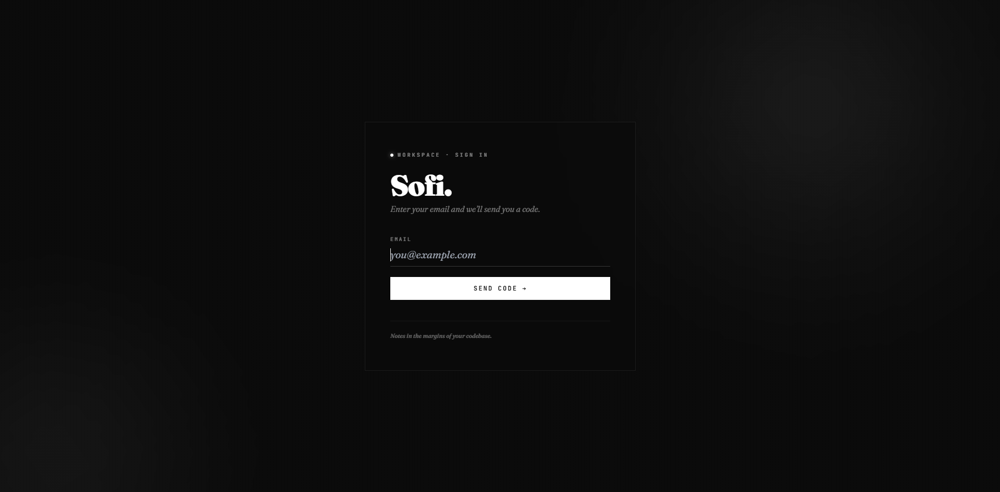

# Sofi IDE

A web-based cloud IDE with integrated AI assistant, terminal emulation, and multi-project support. Built with [Next.js 14](https://nextjs.org/) and [React 18](https://react.dev/).



## Features

- **Code Editor** — Powered by [Monaco Editor](https://microsoft.github.io/monaco-editor/) (the engine behind VS Code)
- **AI Assistant** — Integrated chat with [Claude](https://claude.ai) via the [Claude CLI](https://github.com/anthropics/claude-code). Conversations are persisted in `localStorage` and resumed via Claude session IDs.
- **Terminal** — WebSocket-based PTY terminal using [xterm.js](https://xtermjs.org/) and [node-pty](https://github.com/microsoft/node-pty). On Linux/macOS, [tmux](https://github.com/tmux/tmux) provides session persistence (terminals survive page refreshes). On Windows, a direct shell (`powershell.exe`) is used instead.
- **File Manager** — Browse, create, edit, rename, and delete files and folders
- **Multi-Project** — Switch between projects, each with isolated workspaces and chats
- **Code Execution** — Run Python and JavaScript/TypeScript code server-side
- **Python Linting** — Real-time linting via [pyflakes](https://github.com/PyCQA/pyflakes)
- **Project Import** — Upload `.zip` archives to bootstrap new projects
- **Email Auth** — Passwordless login via magic codes sent through [Resend](https://resend.com/)
- **Multi-Terminal** — Multiple terminal tabs with split-panel support
- **Multi-Chat** — Multiple concurrent AI conversations per project

## Prerequisites

- **Node.js** 18+ ([download](https://nodejs.org/))
- **npm** (ships with Node.js)
- **tmux** (optional, for terminal session persistence on Linux/macOS) — [install](https://github.com/tmux/tmux/wiki/Installing)
- **Claude CLI** (optional, for AI chat features) — [install guide](https://docs.anthropic.com/en/docs/claude-code/overview)
- **Python 3** (optional, for code execution and linting) — [download](https://www.python.org/downloads/)

## Getting Started

### 1. Clone and install

```bash
git clone <your-repo-url>
cd sofi-ide
npm install
```

### 2. Configure environment

Rename `.env.example` to `.env` and fill in the values:

```env
RESEND_API_KEY=re_xxxxx          # Get one at https://resend.com/api-keys
ALLOWED_EMAIL=your@email.com     # Only this email can log in
```

### 3. Run in development

```bash
npm run dev
```

Open [http://localhost:3000](http://localhost:3000) in your browser.

### 4. Production build

```bash
npm run build
npm start
```

## Scripts

| Command | Description |
|---|---|
| `npm run dev` | Start development server with hot reload |
| `npm run build` | Build for production |
| `npm start` | Start production server |

## Platform Support

| Feature | Linux | macOS | Windows |
|---|---|---|---|
| PTY terminal | ✅ (node-pty + tmux) | ✅ (node-pty + tmux) | ✅ (node-pty + PowerShell) |
| Session persistence | ✅ (tmux) | ✅ (tmux) | ❌ |
| AI chat | ✅ (Claude CLI) | ✅ (Claude CLI) | ⚠️ (experimental) |
| Code execution | ✅ | ✅ | ✅ |
| File management | ✅ | ✅ | ✅ |
| Project import | ✅ | ✅ | ✅ |

## Tech Stack

| Library | Purpose |
|---|---|
| [Next.js 14](https://nextjs.org/) | React framework with App Router |
| [React 18](https://react.dev/) | UI library |
| [Monaco Editor](https://microsoft.github.io/monaco-editor/) | Code editor component |
| [Zustand](https://github.com/pmndrs/zustand) | State management with localStorage persistence |
| [Tailwind CSS](https://tailwindcss.com/) | Utility-first styling |
| [xterm.js](https://xtermjs.org/) | Terminal emulator in the browser |
| [node-pty](https://github.com/microsoft/node-pty) | Pseudoterminal for the server-side shell |
| [Resend](https://resend.com/) | Email delivery for auth codes |
| [Lucide React](https://lucide.dev/) | Icon library |
| [JSZip](https://stuk.github.io/jszip/) | ZIP file handling |
| [ws](https://github.com/websockets/ws) | WebSocket server |
| [cross-env](https://github.com/kentcdodds/cross-env) | Cross-platform environment variables |

## Architecture

```
┌─────────────────────────────────────────────┐
│                 Browser                      │
│  Monaco Editor  │  xterm.js  │  Chat UI     │
└──────────┬──────────────────────┬───────────┘
           │ HTTP/WS              │ HTTP/SSE
┌──────────▼──────────────────────▼───────────┐
│           Next.js Server (server-custom.js)  │
│  ┌────────┐  ┌──────────┐  ┌─────────────┐ │
│  │ Files  │  │Terminal  │  │  AI Proxy   │ │
│  │ API    │  │WS + PTY  │  │  (Claude)   │ │
│  └────────┘  └──────────┘  └─────────────┘ │
└─────────────────────────────────────────────┘
```

## License

MIT
